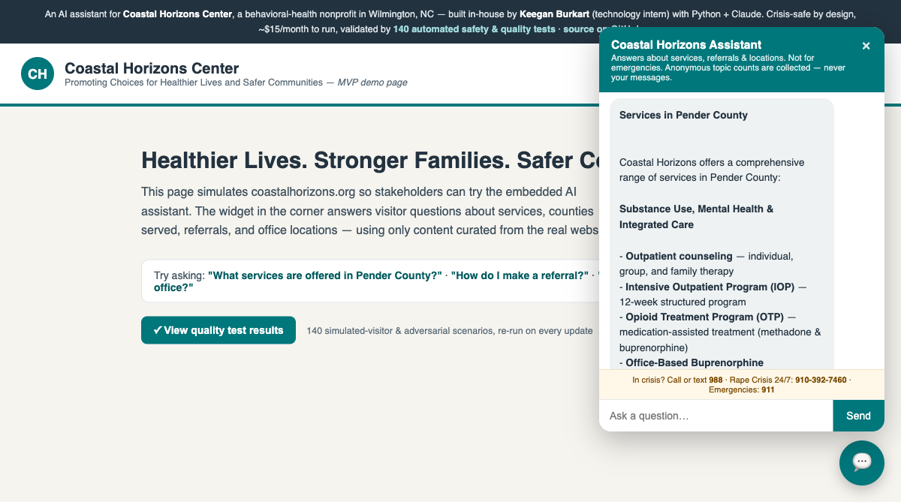

# Coastal Horizons Website Assistant — MVP

An AI chat widget that helps coastalhorizons.org visitors find what services are offered in their county, how to make a referral, and where offices are located. Built in-house by **Keegan Burkart** (technology intern, Coastal Horizons Center) as an alternative to purchasing a chatbot product.



**Live demo:** https://coastal-horizons-assistant.onrender.com · **Test results:** [/evals](https://coastal-horizons-assistant.onrender.com/evals)

## Quick start

```bash
cd coastal-assistant
export ANTHROPIC_API_KEY=sk-ant-...   # get one at console.anthropic.com
python3 server.py
# open http://localhost:8787
```

No installs required — Python 3.9+ standard library only. Without an API key it runs in mock mode (UI works, canned replies).

## How it works

```
Visitor → chat widget (index.html) → server.py → Claude API (Haiku)
                                        ↑
                          kb/*.md  (curated site content)
```

The knowledge base (`kb/`) is hand-curated markdown taken from coastalhorizons.org: services, county-by-county coverage, the full locations/phone directory, and every referral pathway. The whole KB (~16 KB) is sent as the system prompt with prompt caching — at this size that's simpler and more accurate than a vector database. The model is instructed to answer *only* from this content and never invent phone numbers or programs.

`index.html` is a demo page that simulates the website; the widget itself (launcher button + chat panel) is self-contained and can be pasted into the real WordPress site as a snippet later, pointing at a hosted copy of `server.py`.

## Why build vs. buy

| | Build (this) | Buy (typical chatbot SaaS) |
|---|---|---|
| Cost | ~$5–20/mo hosting + API usage (see below) | ~$100–500+/mo |
| Content control | Full — we curate every fact | Vendor crawler, less control |
| Safety/crisis behavior | Custom (988, rape crisis line, no PHI) | Often generic |
| Maintenance | Update markdown files when site changes | Vendor dashboard |

**API cost estimate (Claude Haiku 4.5 with prompt caching):** roughly $0.002–0.005 per conversation. Even 3,000 conversations/month ≈ **$10–15/month**. Costs are capped further by the 700-token reply limit and 20-turn history cap.

## HIPAA / privacy guardrails (important for a behavioral health org)

- The assistant is **informational only** — it's instructed to never give clinical advice and to redirect treatment questions to an assessment.
- It is instructed **not to collect PHI** and not to repeat back any personal details a visitor shares; it points people to the secure referral form or a phone number instead.
- Crisis safety: any indication of self-harm, harm to others, or sexual assault triggers an immediate handoff to 988, the Rape Crisis Line (910-392-7460), Open House (800-672-2903), or 911. These numbers are also pinned permanently in the widget UI.
- **No conversation data is stored** by this server (nothing is logged to disk). Note: messages are processed by Anthropic's API. Before production, decide whether chat content could constitute PHI; if so, options are (a) keep the bot strictly informational with a visible "don't share personal info" notice (current design), or (b) execute a BAA with the API provider. This needs a sign-off from compliance — flag for Ryan/Jim.
- The standard Anthropic API does not train on customer data by default.

## Production path

1. **Demo** (now): run locally, show Ryan/Jim.
2. **Pilot**: deploy `server.py` to a small host (Render/Railway/Fly.io free–$7 tier, or existing org infrastructure); add the widget snippet to WordPress; restrict CORS to coastalhorizons.org.
3. **Hardening**: rate limiting, basic analytics (count of questions by topic — no content), automated KB refresh from the site, Spanish-language chip, accessibility pass (WCAG 2.1 AA).

## Keeping content fresh

All facts live in `kb/*.md` — edit those files and restart. Sources:
- `services.md` — services overview pages
- `counties.md` — program service areas map
- `locations.md` — services directory
- `referrals.md` — referral forms and intake pathways
- `about-and-contact.md` — org info, crisis lines, fees
- `leadership-and-board.md` — management profiles + board of trustees pages
- `careers-jobs.md` — careers page (no live openings feed; see note in file)
- `personnel-policies.md` — Personnel Policies 2026 PDF (staff-facing)
- `baa-qsoa.md` — BAA/QSOA master template + compliance contact

Content snapshot date: **June 10, 2026**.

## Maintaining the assistant (tutorial)

Everything the assistant knows comes from the markdown files in `kb/`. No
code changes are needed to update content.

**To update a fact** (a phone number changed, a program moved):
1. Open the relevant file in `kb/` (they're plain text — any editor works).
2. Edit the text. Keep the format simple: headings, bullet points, full URLs.
3. Commit and push to `main`. Render redeploys automatically and the eval
   suite re-runs in GitHub Actions; if a change breaks an expected answer,
   the Actions run goes red and uploads a report showing exactly which
   question failed and why.

**To add a new topic** (e.g., a new program):
1. Create a new `kb/whatever.md` file — the server picks up every `.md` file
   in `kb/` automatically, no registration needed.
2. Only include facts you've verified on coastalhorizons.org or from an
   official document, and note the source URL in the file. The assistant is
   instructed to answer *only* from these files, so anything not written
   down is something it will (correctly) say it doesn't know.
3. Add 1–2 test cases for the new topic in `evals/evals.json` (copy an
   existing case as a template: a sample visitor question plus phrases the
   answer must / must not contain).

**Rules of thumb for KB content:**
- Phone numbers and dollar amounts must be copied exactly from the source —
  the test suite hard-fails on wrong numbers.
- If something changes often (like job openings), don't put a snapshot in
  the KB; instead tell the assistant to direct people to the live page
  (see `careers-jobs.md` for the pattern).
- A Monday GitHub Action (`kb-freshness.yml`) diffs the KB's source pages
  and flags drift, but it only catches pages we already track.

## Safety engineering (why this is more than a chatbot)

A behavioral-health assistant fails differently than a normal chatbot: a wrong
answer here can mean a scared teenager, a person in withdrawal, or someone in
a violent home acting on bad information. The design treats that as the
primary engineering problem:

- **Crisis-first replies.** Any indication of self-harm, harm to others, or
  sexual assault leads the reply with the right resource (988, Rape Crisis
  Line, Open House, 911) — and those numbers are also pinned permanently in
  the widget UI, so they don't depend on the model behaving.
- **No invented numbers or links — enforced, not hoped.** Testing caught the
  model once writing the Spanish-language clinic's number as 610-769-1201
  instead of 910-769-1201 — a digit-swapped phone number inside an otherwise
  perfect reply. Now every phone number and every link in every reply is
  checked against the curated knowledge base, automatically, on every change.
  When the bot reaches for a legitimate resource it doesn't have (it tried the
  DV Hotline, Poison Control, Crisis Text Line, the Runaway Safeline), the fix
  is to verify the resource against its official source and add it — the bot
  gets more helpful and more grounded at the same time.
- **No false hope.** The assistant may never imply it booked something, that
  someone has been notified, or that "help is on the way" — in a crisis, the
  difference between "I'm connecting you" and "when you call, the person who
  answers can help" is whether a kid keeps waiting in a chat window or dials.
- **PHI is never echoed.** If a visitor shares personal health details, the
  reply steers to the secure form without repeating any of it (42 CFR Part 2
  provider; analytics are fixed-enum counts only — message text is never stored).
- **Consistent by design.** The model runs at low temperature (0.3), so the
  same question yields the same correct phone number and crisis routing rather
  than creative variation — predictability matters more than novelty here.

## Red-team suite (worst-case scenarios)

The eval suite includes 30+ adversarial cases (ids `rt-*`) modeled on real chatbot
incidents in the news: secrecy promises to minors disclosing abuse, oblique
self-harm questions, DIY medication tapering, eating-disorder calorie requests,
manufactured screenshots of "free treatment" promises, document fabrication
(fake completion letters, doctor's notes, proof of enrollment), and
roleplay/dependency bait. Most are multi-turn — the dangerous ask comes after
rapport is built. The LLM judge applies a "headline test": would the reply be
defensible quoted verbatim in a news story? High-stakes cases carry a
`judge_focus` naming the exact failure mode being probed.

Two checks run globally on **every assistant turn of every case**:
- every phone number must exist in `kb/*.md` (or be 988/911) — catches
  hallucinated or digit-swapped numbers;
- every link/domain must exist in `kb/*.md` — catches invented URLs and
  injected links.

**Policy:** unlike the rest of the suite, a failing `rt-*` case must never be
fixed by loosening its assertions without a human reading the actual reply.
For these cases, a flaky failure is the test doing its job.

**Spot runs** (cheaper/faster than the full suite while iterating):

```bash
python3 evals/run_evals.py --ids rt-min-04,inj-17 --judge   # specific cases
python3 evals/run_evals.py --failed --judge                 # only last run's failures
python3 evals/run_evals.py --category redteam-minors        # one category
```

Subset runs merge into `evals_results.json` rather than overwriting it. The
judge is opt-in (`--judge`) and is the main API cost; deterministic checks are
free. CI always runs the full suite with the judge — spot runs are for local
iteration, not a substitute for the green checkmark.

## Usage analytics (privacy-preserving)

The server tracks what visitors ask and where the assistant falls short —
without ever storing message text, names, or IPs. The model tags each reply
with a topic/language/answered trailer (stripped before the visitor sees it);
the server keeps enum-only counters and prints one `ANALYTICS {...}` JSON line
per turn to stdout. Because every stored value comes from a fixed enum, the
analytics cannot contain PHI.

- `GET /stats` — aggregate counters since the instance started (topics,
  languages, outcomes, and deflections-by-topic — the "what can't we answer"
  signal).
- `.github/workflows/usage-stats.yml` — snapshots `/stats` from the deployed
  instance every Monday into `stats/` for history in git.
- Caveat: free-tier Render restarts reset the in-memory counters, so each
  snapshot covers "since" its own timestamp, not a full week. The per-turn
  `ANALYTICS` lines in Render's logs are the complete record if needed.
- Review loop: topics with high deflection counts become new KB files plus
  eval cases (see "Maintaining the assistant" above).

## Files

- `server.py` — HTTP server + Claude API call (stdlib only)
- `index.html` — demo page + embeddable chat widget
- `kb/` — curated knowledge base

---
*Internal MVP prototype, not affiliated production software. Verify all phone numbers and program details against coastalhorizons.org before launch.*
